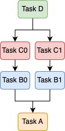

# kannon

Kannon is a wrapper for the [gokart](https://github.com/m3dev/gokart) library that allows gokart tasks to be easily executed in a distributed and parallel manner on multiple [kubernetes](https://kubernetes.io/) jobs.

# Install
Kannon can be installed via `pip`.

```bash
pip install kannon
```

# Usage
It is required for users to prepare following two scripts and copy them into a docker container:
- A script to start task pipeline on master job.
- A script for child jobs to run assigned tasks.

Easy and self-contained quick starter will be available soon!

## Give custom permissions to the service account
If you have a service account `my-batch` within a namespace `mynamespace`, the following permissions on `jobs` and `jobs/status` should be added.

```yml
# role.yaml
apiVersion: rbac.authorization.k8s.io/v1
kind: Role
metadata:
  namespace: mynamespace
  name: job-admin
rules:
  - apiGroups: ["batch"]
    resources: ["jobs"]
    verbs: ["get", "list", "watch", "create", "update", "patch", "delete"]
  - apiGroups: ["batch"]
    resources: ["jobs/status"]
    verbs: ["get", "list", "watch"]

---
apiVersion: rbac.authorization.k8s.io/v1
kind: RoleBinding
metadata:
  name: job-admin-binding
  namespace: mynamespace
roleRef:
  apiGroup: rbac.authorization.k8s.io
  kind: Role
  name: job-admin
subjects:
  - namespace: mynamespace
    kind: ServiceAccount
    name: my-batch
```

## How to define tasks
The way to define tasks is almost the same as for gokart.
All you have to do is replace the parent class of the task class you want to distribute with `kannon.TaskOnBullet` from `gokart.TaskOnKart`.

To get detailed explanations on how to define a `gokart.TaskOnKart`, please refer to [gokart docs](https://gokart.readthedocs.io/en/latest/task_on_kart.html).

Here is an example to define the following task pipeline with gokart and kannon.

<div align="center">



</div>

Two parts (Task B0 + Task C0) and (Task B1 + Task C1) can be run in a distributed and parallel manner.

```python
import gokart
import luigi
import kannon


class TaskA(gokart.TaskOnKart):
    param = luigi.Parameter()

    def run(self):
        self.dump("A")

# TODO: Change gokart.TaskOnKart -> kannon.TaskOnBullet
class TaskB(kannon.TaskOnBullet):
    param = luigi.Parameter()
    parent = gokart.TaskInstanceParameter()
    
    def requires(self):
        return {"parent": self.parent}

    def run(self):
        self.dump("B")

# TODO: Change gokart.TaskOnKart -> kannon.TaskOnBullet
class TaskC(kannon.TaskOnBullet):
    param = luigi.Parameter()
    parent = gokart.TaskInstanceParameter()
    
    def requires(self):
        return {"parent": self.parent}

    def run(self):
        self.dump("C")


class TaskD(gokart.TaskOnKart):
    param = luigi.Parameter()
    parent_0 = gokart.TaskInstanceParameter()
    parent_1 = gokart.TaskInstanceParameter()
    parent_2 = gokart.TaskInstanceParameter()
    
    def requires(self):
        return {"parent_0": self.parent_0, "parent_1": self.parent_1, "parent_2": self.parent_2}

    def run(self):
        self.dump("D")

task_a = TaskA(param="a")
# b0 and b1 are executed in parallel
task_b0 = TaskB(param="b0", parent=task_a)
task_b1 = TaskB(param="b1", parent=task_a)
# c0 and c1 are executed in parallel
task_c0 = TaskC(param="c0", parent=task_b0)
task_c1 = TaskC(param="c1", parent=task_b1)
task_d = TaskD(param="d", parent_0=task_c0, parent_1=task_c1, parent_2=task_a)
```


## A script to run job on master job
Steps:
1. Import module where `gokart.TaskOnKart` and `kannon.TaskOnBullet` classes are defined.
2. Load luigi and k8s configs.
3. Create a task instance.
4. Create a template job for child jobs.
5. Run `Kannon.build`.

```python
""" This script runs on master job. """
import logging

import gokart
import luigi
from kubernetes import config, client
import fire

# TODO: Import task definition here!
import example_tasks
from kannon import Kannon

logging.basicConfig(level=logging.INFO)


def main(
    container_name: str,
    image_name: str,
):
    # TODO: Load luigi config here!
    luigi.configuration.LuigiConfigParser.add_config_path("./conf/base.ini")

    # TODO: Load kube config here!
    config.load_incluster_config()
    v1 = client.BatchV1Api()
    # TODO: Create task instance here!
    task_root = [CREATE TASK INSTANCE HERE]
    
    # TODO: create a template for child job from yaml file or using k8s API.
    template_job = utils.create_from_yaml(v1, PATH_TO_CHILD_JOB_YAML)
    # TODO: Run Kannon.build!
    Kannon(
        api_instance=v1,
        template_job=template_job,
        job_prefix="template-child-job",
        path_child_script="./run_child.py",
    ).build(task_root)


if __name__ == "__main__":
    Fire.fire(main)
```

Note that `job.spec.template.containers[i].command` and `job.metadata.name` are replaced within `Kannon.build`. 

## A script for child jobs to run assigned tasks
For now, it is required for users to prepare the following script. In the future release, it will not be required.

Steps:
1. Import module where `gokart.TaskOnKart` and `kannon.TaskOnBullet` classes are defined.
2. Load luigi config.
3. Parse a serialized task instance.
4. Run `gokart.build`.

```python
""" This script requires to be defined by user. """
import gokart
import luigi
import logging

# TODO: Import task definitions here!
import example_tasks

import fire

logging.basicConfig(level=logging.INFO)


def main(serialized_task: str):
    # TODO: Load luigi config here!
    luigi.configuration.LuigiConfigParser.add_config_path("./conf/base.ini")
    
    # TODO: Parse a serialized gokart.TaskOnKart here!
    task: gokart.TaskOnKart = gokart.TaskInstanceParameter().parse(serialized_task)
    # TODO: Run gokart.build!
    gokart.build(task)


if __name__ == "__main__":
    fire.Fire(main)
```

# Thanks

Kannon is a wrapper for gokart. Thanks to gokart and dependent projects!

- [gokart](https://github.com/m3dev/gokart)
