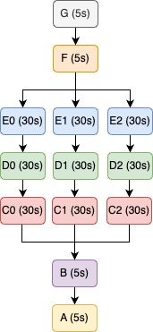

# Quick Starter
This is a easy and self-contained tutorial of `kannon`.

## Requirements
### Install Docker
Install docker from [Get Docker](https://docs.docker.com/get-docker/).

### Install minikube
Install minikube following the instruction on the [minikube start](https://minikube.sigs.k8s.io/docs/start/) document. Make sure the whole setup completed successfully.


## Steps
### 1. Start minikube
Make sure the docker daemon is running.
```bash
$ minikube start
```

### 2. Build docker image
Enable to push a local docker image to the docker daemon within the minikube cluster.
The detail is given [here](https://minikube.sigs.k8s.io/docs/handbook/pushing/#1-pushing-directly-to-the-in-cluster-docker-daemon-docker-env).
```bash
$ eval $(minikube docker-env)
```

Build a docker image from `example/Dockerfile`.
```bash
$ cd ./example
$ docker build -t kannon_quick_starter .
```

Now, the docker image is available within the cluster.

### 3. Create the required Kubernetes resources
Create a new namespace `kannon-quick-starter`.
```bash
$ minikube kubectl -- apply -f k8s/ns.yaml
namespace/kannon-quick-starter created
```

Create a new service account, role, and role-biding.
```bash
$ minikube kubectl -- apply -f k8s/sa.yaml
serviceaccount/job-manager created
role.rbac.authorization.k8s.io/job-manager-role created
rolebinding.rbac.authorization.k8s.io/job-manager-rolebinding created
```

Create a new persistent volume and persistent volume claim, which is used as a common cache for multiple k8s jobs.
```bash
$ minikube kubectl -- apply -f k8s/pv.yaml
persistentvolume/kannon-cache created
persistentvolumeclaim/kannon-cache-claim created
```


### 4. Check task definition
gokart tasks to be run are defined in `example/tasks.py`.

In this quick starter, the following tasks will be run.
Each block represents a single task, `TaskName (duration)`

<div align="center">



</div>

In `tasks.py`, `TaskC`, `TaskD`, and `TaskD` inherits `kannon.TaskOnBullet` instead of `gokart.TaskOnKart`, so Task C0-C2, D0-D2, and E0-E2 are run on different jobs in parallel.

```python
# example/tasks.py
class TaskC(kannon.TaskOnBullet):
    ...

class TaskD(kannon.TaskOnBullet):
    ...

class TaskE(kannon.TaskOnBullet):
    ...
```

Since Task C, D, and E are tasks that will take longer time than other tasks and they can be run in parallel, `kannon` will be very effective! Let's check it.


### 5. Run master job
Run the master job!
```bash
$ minikube kubectl -- apply -f k8s/master-job.yaml
job.batch/master-job-quick-starter created
```

Let's check running jobs. You can see 3 child tasks are running on multiple jobs in parallel.
```bash
$ minikube kubectl -- get jobs -n kannon-quick-starter
NAME                                     COMPLETIONS   DURATION   AGE
# C0-C2 are done in parallel
master-job-quick-starter                 0/1           65s        65s
quick-starter-taskc-069-20230416142331   1/1           35s        51s
quick-starter-taskc-169-20230416142334   1/1           35s        48s
quick-starter-taskc-191-20230416142337   1/1           35s        45s
# now, D0-D2 are running in parallel
quick-starter-taskd-014-20230416142415   0/1           7s         7s
quick-starter-taskd-036-20230416142406   0/1           16s        16s
quick-starter-taskd-079-20230416142417   0/1           5s         5s
```

### 6. Check the result
Let's check the final result.
```bash
$ minikube kubectl --  get jobs -n kannon-quick-starter
NAME                                     COMPLETIONS   DURATION   AGE
master-job-quick-starter                 1/1           2m28s      3m13s
# C0-C2 are done in parallel
quick-starter-taskc-069-20230416142331   1/1           35s        2m59s
quick-starter-taskc-169-20230416142334   1/1           35s        2m56s
quick-starter-taskc-191-20230416142337   1/1           35s        2m53s
# D0-D2 are done in parallel
quick-starter-taskd-014-20230416142415   1/1           36s        2m15s
quick-starter-taskd-036-20230416142406   1/1           35s        2m24s
quick-starter-taskd-079-20230416142417   1/1           36s        2m13s
# E0-E2 are done in parallel
quick-starter-taske-118-20230416142442   1/1           34s        108s
quick-starter-taske-143-20230416142455   1/1           34s        95s
quick-starter-taske-146-20230416142456   1/1           34s        94s
```

All jobs are completed successfully!
Duration for the master job to be completed is `2m28s`.
Compared to the case without `kannon`, it is almost **2x** faster!

|using kannon? | duration |
|---|---|
|yes | **2m28s**|
|no | 5m09s|


### (Optional) Clear the cache to rerun the tasks
```bash
$ minikube kubectl -- apply -f k8s/temp-pod.yaml
pod/temp-pod created

$ minikube kubectl -- exec -it temp-pod -n kannon-quick-starter -- /bin/sh
```

Within `temp-pod`, execute the following commands.
```
/ #
/ # ls cache/
log    tasks
/ # rm -rf cache/*
```
Now, all caches saved on the persistent volume `kannon-cache` are cleared.

### (Optional) Clean up
```bash
# Delete namespace
$ minikube kubectl -- delete ns kannon-quick-starter
# Delete persistent volume
$ minikube kubectl -- delete pv kannon-cache
```
